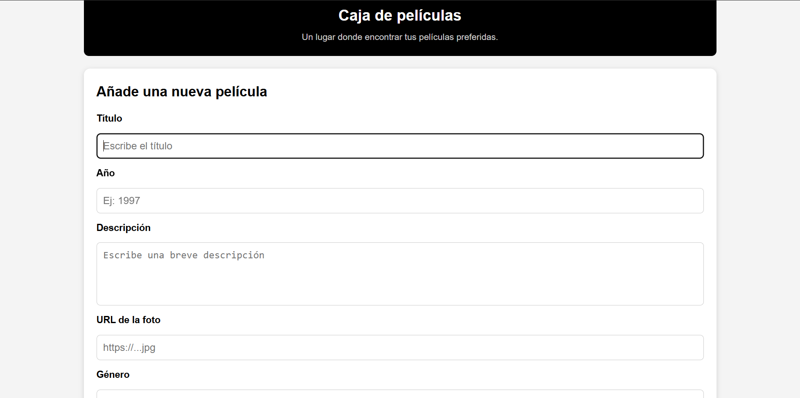
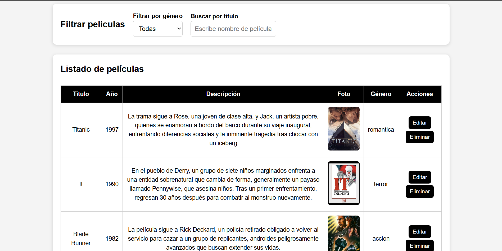

# Caja de Películas

Aplicación web sencilla para gestionar una colección de películas.  
Permite **añadir**, **editar**, **eliminar**, **buscar** y **filtrar** películas de forma dinámica utilizando JavaScript, HTML y CSS.

---

## Funcionalidades

### Añadir película
El usuario puede añadir una nueva película rellenando un formulario con:
- Título  
- Año  
- Descripción  
- URL de la imagen  
- Género  

El formulario incluye **validación** para evitar datos incorrectos.

---

### Editar película
Cada película del listado tiene un botón **Editar** que permite modificar sus datos directamente en la tabla.  
Incluye:
- Inputs dinámicos  
- Select de género  
- Botón Guardar

---

### Eliminar película
Cada fila tiene un botón **Eliminar** que borra la película del listado.

---

### Buscar por título
Un buscador permite filtrar películas escribiendo parte del título.  
La búsqueda es **insensible a mayúsculas/minúsculas**.

---

### Filtrar por género
Un desplegable permite mostrar las peliculas por generos:
- Todas las películas  
- Terror  
- Acción  
- Comedia  
- Romántica  

El filtrado funciona en tiempo real.

---

### Diseño responsive
La aplicación está adaptada para móviles:
- La tabla se vuelve desplazable horizontalmente  
- El contenido se ajusta al ancho de pantalla  
- El body ocupa siempre el 100% del viewport  

---

## Tecnologías utilizadas

- **HTML5**  
- **CSS3** (responsive, variables, sombras, estilos limpios)  
- **JavaScript** (DOM, eventos, validación, render dinámico)

---

## Estructura del proyecto
```
/caja-peliculas/
│
├── index.html
├── style.css
├── script.js
├── README.md
│
├── assets/
│   ├── peliculas1.png
│   ├── peliculas2.png
```
## Cómo funciona

1. El archivo `script.js` contiene:
   - El array inicial de películas  
   - La lógica para añadir, editar y eliminar  
   - El filtrado por género y búsqueda  
   - El renderizado dinámico de la tabla  

2. El HTML define:
   - Formulario de alta  
   - Sección de filtros  
   - Tabla de películas dentro de `.tabla-responsive`  

3. El CSS controla:
   - Estilos generales  
   - Diseño responsive  
   - Comportamiento de la tabla en móvil  

---

## Capturas del proyecto


### Página principal




### Tabla




---
## Cómo clonar y ejecutar el proyecto

Sigue estos pasos para obtener una copia del proyecto y ejecutarlo en tu ordenador:

### Clonar el repositorio

Abre una terminal y ejecuta:

```bash
git clone https://github.com/Elegm92/practica-peliculas
```

Después entra en la carpeta del proyecto:

```bash
cd landin_peliculas
```
---
## Cómo ejecutar el proyecto

1. Descarga o clona el repositorio.
2. Abre la pagina con (https://elegm92.github.io/practica-peliculas/).
3. Abre el archivo **index.html** en tu navegador.
4. Navega por las diferentes secciones de la página.


---

## Autor

Proyecto realizado por **Elena González** como práctica de desarrollo web.
